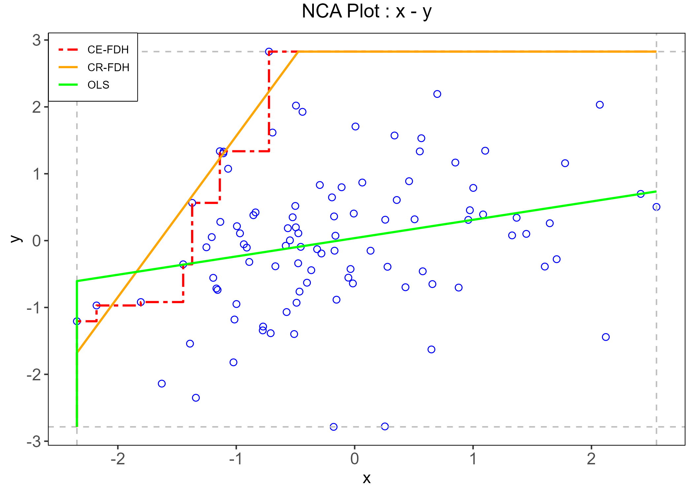

```{r}
#| echo: false

set.seed(1)
```

:::{columns}
:::{.column width = "30%"}

```{r}
#| fig-width: 2
#| echo: false


```

:::
:::{.column width = "70%"}

::: {style="font-size:0.8em; line-height:1.15;"}
> “Look for the bare necessities, the simple bare necessities\
> Forget about your worries and your strife \
> I mean the bare necessities, old mother nature \
> That bring the bare necessities of life”
>
> Terry Gilkyson, *The Bare Necessities* (1967)

:::

:::
:::

## A 'new' method in town

There is now a 'new' temptingly efficient way to generate a fresh psychological paper, wonderful insights, serendipity! 

  - Step 1: Take two variables that correlate
  - Step 2: Draw a scatterplot.

```{r}
#| echo: false
#| label: fig-scatterplot
#| fig-cap: A scatterplot for your scientific insights!

set.seed(1234)
x = rnorm(100)
y = .30*x + rnorm(100)
d <- data.frame(x,y)

plot(x,y)

```

What do you notice? Is there any white space in those corner? Wow! 

Make sure it's not a trick of your mind. White space in the upper-left corner of your scatterplot! What could it be?

  - Step 3: Run Necessary Condition Analysis (NCA) to test if it is really blank.  
  - Step 4: NCA detects an effect. Is significant. 
  - Step 5: Declare that a certain level of *X is necessary for Y* to appear.

Congratulations: your correlation has been promoted from a mildly respectable average effect to a theoretical bottleneck.

That is, of course, slightly impolite (but true!). 

NCA is an interesting method with a legitimate aim. It asks a different question from regression. Instead of asking whether higher values of $X$ are associated with higher values of $Y$ *on average*, it asks whether some level of $X$ is *required* before a given level of $Y$ can occur [@dulNecessaryConditionAnalysis2016; @dulNecessaryConditionAnalysis2023]. In fields where variables have natural units and clear substantive thresholds, that question can be meaningful. For instance, what is the minimum salary required from all banks to give a 100k loan?

Psychology, however, is not full of natural units. It is full of latent constructs hiding behind observed scores on tests, questionnaires, tasks.

## What NCA actually estimates

The basic logic of NCA is simple and elegant. If low values of a condition are incompatible with high values of an outcome, then the upper-left corner of the $X$-$Y$ scatterplot should be empty. NCA quantifies that empty region, estimates a ceiling line, and summarizes the pattern through an effect size and a bottleneck table [see fig-nca @dulNecessaryConditionAnalysis2016].

That geometric intuition is exactly why the method is attractive. But it is also exactly why psychology is an awkward habitat for it.

```{r}
#| message: false
#| warning: false
fit <- NCA::nca(d, 1,2)
res <- NCA::nca_output(fit, plots = TRUE, summaries = FALSE)
```


```{r}
#| message: false
#| warning: false
#| echo: false
#| label: fig-nca
#| fig-cap: Example of an NCA plot. The scatterplot shows the relation between X and Y. NCA evaluates whether X is necessary for Y by identifying an empty upper-left region, meaning that high values of Y are absent when X is low. The ceiling lines (CE-FDH and CR-FDH) mark the estimated boundary of this empty space, while the OLS line is included only to contrast NCA with standard regression approaches. 


ggplot2::ggsave("imgs/ncaplot.png",res$plots[[1]])

```

NCA does not estimate a latent relation, a structural parameter, or a causal mechanism. It estimates a property of the **observed score space**: the size of a ceiling zone relative to a scope, plus the bottleneck values implied by the estimated ceiling line. The threshold it reports is therefore tied to the metric of the score representation itself. Change the coding, the scoring rule, the number of response categories, the item thresholds, or the sample range, and you may change the NCA result even when the underlying latent relation is held constant.

> Change the questionnaire you are using to measure depression, and everything changes!

A method that lives on sparse regions of the scatterplot is naturally sensitive to the exact way the scatterplot was manufactured. So before asking whether *intelligence is necessary for creativity* or whether *self-control is necessary for academic success*, one first has to ask a less glamorous but more important question: necessary in the construct, or necessary in this particular score representation? \[in this particular sample?\]

## A small simulation

Don't you believe?

A way to test my previous assertions is to simulate multiple scenarios thousands of times. In each replication, one latent paired dataset was generated first. NCA was then computed on those latent variables as a reference. Starting from that same latent dataset, multiple observed versions were created by changing score construction, loading strength, ordinal scaling, threshold placement, and sample restriction. NCA was then recomputed on each observed dataset.

> **If the latent relation stays the same, how much does the observed NCA estimate move just because psychology measures things the way psychology usually measures things?**

The answer is: quite a lot.

### Score construction

With the same latent relation, factor-score NCA was systematically larger than sum-score NCA. Averaged across design cells, the mean NCA effect was about $d = .149$ for factor scores and $d = .121$ for sum scores, even though the mean observed correlations were essentially identical in the two cases (both about $r = .331$). In other words, two score types can tell almost the same correlation story while telling noticeably different necessity stories.

### Reliability and loading strength

The reliability block is even more awkward for simple intuitions. As loadings increased from .50 to .85, the mean observed correlation rose from about $r = .255$ to $r = .366$, but the mean NCA effect **decreased** from about $d = .132$ to $d = .087$.

That is a useful reminder that NCA is not just another correlation method. It tracks geometry and more reliable measurement does not mechanically yield a larger necessity estimate. Sometimes it yields a smaller one.

### Response categories

The number of response categories mattered a lot. Moving from 4 to 7 categories increased the mean NCA effect from about $d = .080$ to $d = .165$, with only small changes in the average correlation (roughly $r = .326$ to $r = .334$). Put differently: changing the granularity of the ruler changed the estimated bottleneck, even when the underlying latent relation was held fixed.

> What kind of theoretical advancement can a method provide if it depends on how many options our questionnaire has?

### Threshold placement and induced skewness

When item thresholds were shifted to induce asymmetric score distributions, observed skewness moved to roughly $\pm .27$, $\pm .39$, and $\pm .61$ (way below general cut-offs of problematic skewness). Across these conditions, the mean NCA effect fell from about $d = .113$ at the mild shift to about $d = .100$ at the strongest shift. The direction of the shift mattered surprisingly little; lower and upper shifts produced very similar average NCA values.

### Range restriction

Range restriction also mattered in a way that should make applied researchers uneasy. Restricting the sample to the lower side of $X$ or upper side of $Y$ yielded mean NCA effects around $d = .133$, whereas restricting to the upper side of $X$ or lower side of $Y$ brought them down to about $d = .096$. These are shifts large enough to support different rhetorical summaries of the same phenomenon. One sample could make the bottleneck look substantial; another could make it look modest. Yet the difference may reside less in theory than in who happened to be admitted into the dataset.

### Sample size alone changes the estimate

But beside every psychometric issue, a *sufficient* problem to rule NCA out under a latent-association theoretical model is the problem of sample size: Even in a latent-only simulation with the same target correlation of about $r = .40$, the mean NCA effect declined from about $d = .201$ at $n = 250$ to about $d = .172$ at $n = 10{,}000$.

That is worth pausing on. The latent relation stayed basically the same. The correlation stayed basically the same. The NCA effect drifted downward as sample size increased. A method that changes when the ruler changes is one thing (this happens also to attenuated correlations). A method that changes its estimates when the sample size increases, it is on another level of problematicity.

> Larger samples are simply more likely to populate regions of the $X$-$Y$ space that smaller samples leave empty by chance. Under ordinary stochastic relations, the empty corner is therefore not strong evidence for an underlying necessity structure; it is often evidence that the sample has not yet filled the corner.

## The main lesson

**NCA often operates on properties of observed score geometry rather than on stable properties of latent constructs**. 

Until NCA does not develop a way to account for measurement error under an NCA psychometric model, NCA estimates would never be reliable nor credible.

That means the interpretive leap from “there is an empty corner in this score space” to “this construct is necessary for that construct” is usually much larger than the final discussion section lets on.

And this is where some of the more enthusiastic uses of NCA become difficult to defend. Many psychological theories do not posit necessity relations in the strict sense. They posit probabilistic tendencies, reciprocal influences, multiple pathways, moderators, nonlinearities, developmental contingencies, and measurement error. Declaring necessity after spotting a sparse upper-left corner can therefore produce the peculiar feeling that a rich theory has been replaced by a geometry-based slogan.

In my opinion, better modeling approach already exist that answer similar questions, such as segmented regressions, gam and so on. These, however are probably not as attractive and much more difficult to defend and publish compared to a newer 'fancy' analysis such as NCA.

## Does this mean NCA is useless?

Maybe not (maybe yes). It means psychology should stop treating it as a way to inform theory.

NCA may still be useful as a descriptive boundary tool when the research question is explicitly about the observed score space (never, probably, who cares about my data if I don't make any inference?) and the scale has unusually clear substantive meaning, or when robustness across multiple defensible score representations has been demonstrated.

What seems much harder to justify is the common move from a single observed-score NCA result to a statement that a latent psychological construct is a necessary precondition for another latent psychological construct. In other words, it seem hard to inform any theory beyond the observed data.

That move is often too quick, too strong, and much easier to publish than to defend.

But...

> The bare necessities of life will come to you \
> They'll come to you! \
> \
> Oh man, that's really livin'

# References
